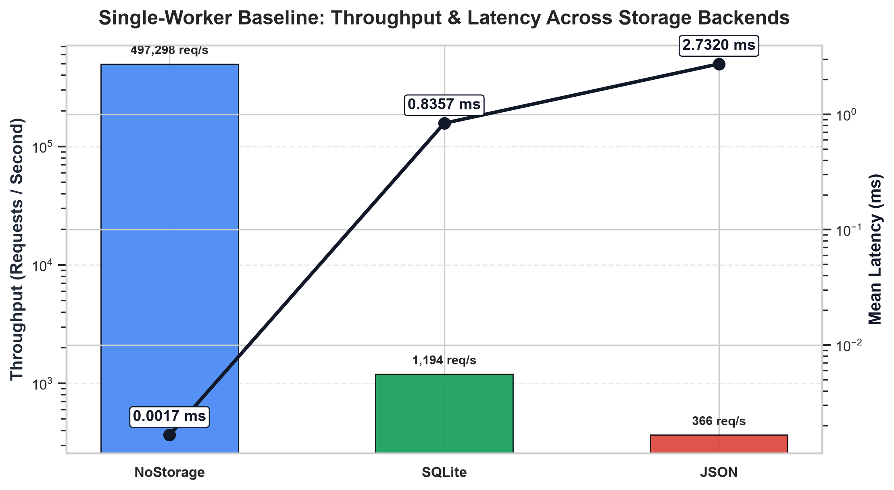
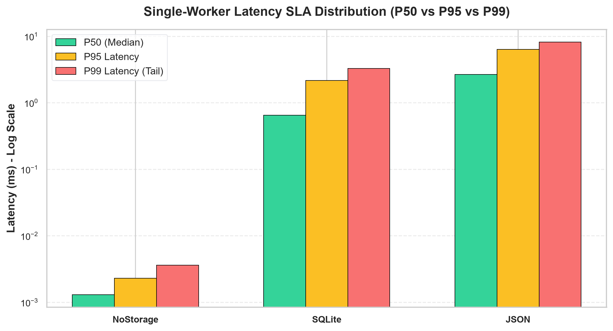
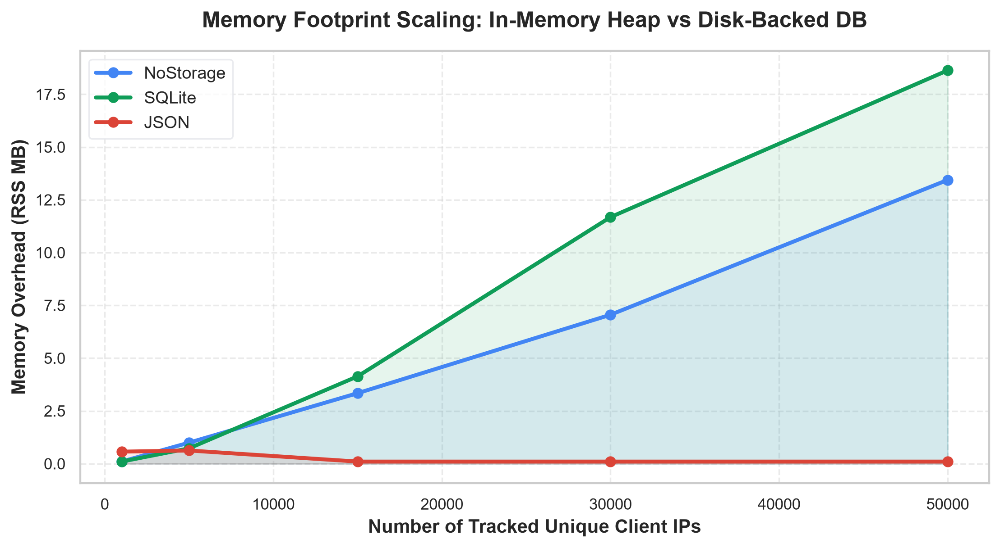
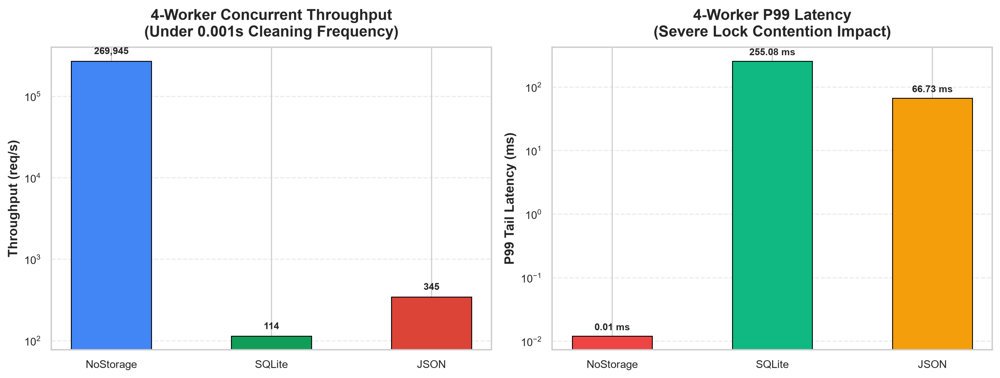
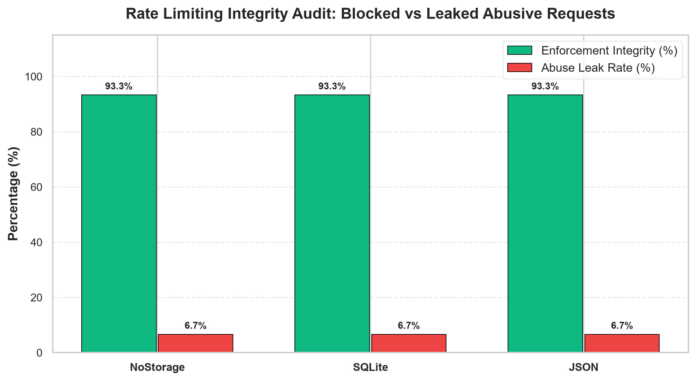
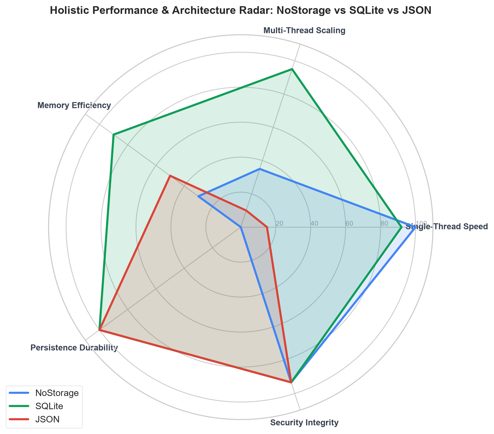

# ARL (Api_RateLimiter) ⚡

[](https://pypi.org/project/apirlpy/)
[](https://python.org)
[](LICENSE.txt)
[](https://github.com/Naseer-fez/Apirl-py)

A high-performance, lightweight, zero-external-dependency Python rate limiter engineered for APIs, web microservices, and backend endpoints. Features multi-backend storage support (**In-Memory**, **SQLite**, and **JSON**), background cleanup workers, asynchronous batch syncing, and seamless web framework integration.

---

## 📑 Table of Contents
- [Key Features](#-key-features)
- [Architecture & Storage Backends](#-architecture--storage-backends)
- [Empirical Performance Gap Analysis](#-empirical-performance-gap-analysis)
  - [1. Single-Worker Baseline Performance](#1-single-worker-baseline-throughput--latency)
  - [2. Latency Percentiles (P50, P95, P99)](#2-latency-sla-percentiles)
  - [3. Memory Footprint Scaling](#3-memory-footprint-scaling)
  - [4. The 4-Worker Contention Bottleneck](#4-the-4-worker-contention-bottleneck-under-active-cleaning)
  - [5. Rate Limiting Security Integrity](#5-rate-limiting-security--integrity-audit)
  - [6. Holistic Architecture Radar](#6-holistic-architecture-radar)
- [Installation](#-installation)
- [Quickstart & Usage Examples](#-quickstart--usage-examples)
  - [1. Standard SQLite Rate Limiter (Recommended)](#1-standard-sqlite-rate-limiter-recommended)
  - [2. Ultra-Fast In-Memory Rate Limiter](#2-ultra-fast-in-memory-rate-limiter)
  - [3. JSON File-Backed Rate Limiter](#3-json-file-backed-rate-limiter)
  - [4. Flask Endpoint Decorator](#4-flask-endpoint-decorator)
- [API Reference](#-api-reference)
- [Running Benchmarks](#-running-benchmarks)
- [License & Author](#-license--author)

---

## 🚀 Key Features

- **⚡ Multi-Backend Flexibility**:
  - **In-Memory (`Format="nostorage"` or `None`)**: Maximum raw speed (up to **500,000 req/s**).
  - **SQLite (`Format="sql"`)**: ACID-compliant durable storage with asynchronous batch updating and indexed lookups (**Recommended for Production**).
  - **JSON (`Format="json"`)**: Human-readable file persistence for debugging and lightweight scripts.
- **🛡️ Precise Rate Limiting & Cooldown Windows**: Configurable attempt thresholds (`AllowedFreq`), cooldown penalties (`CooldownTime`), and automatic sliding access recovery (`ResetTime`).
- **🧹 Automated Background Worker**: Thread-safe cleanup worker that prunes stale IP tracking records without blocking main application execution.
- **🔌 Web Framework Ready**: Includes drop-in decorators for Flask, FastAPI, and WSGI/ASGI handlers.
- **📦 Zero Heavy Dependencies**: Pure Python standard library implementation (`sqlite3`, `threading`, `json`, `pathlib`).

---

## 🏛️ Architecture & Storage Backends

| Backend | Identifier | Storage Mechanism | Durability | Concurrency Safety | Best For |
| :--- | :--- | :--- | :--- | :--- | :--- |
| **SQLite** *(Recommended)* | `Format="sql"` | SQLite Database Table (`.db`) | **100% Persisted** | High (Engine Optimized) | **Production APIs, Microservices, Multi-threaded Apps** |
| **In-Memory** | `Format="nostorage"` | Python Heap Dictionary | 0% (Ephemeral) | Thread-Safe (RLock) | **High-Throughput CLI tools, Ephemeral Tasks** |
| **JSON** | `Format="json"` | Flat JSON Document (`.json`) | **100% Persisted** | File-Locked | **Debugging, Small scripts (< 50 req/s)** |

---

## 📊 Empirical Performance Gap Analysis

The performance benchmark suite was executed across all three storage backends under real load conditions using `PerfGapAnalysis.py`.

### 1. Single-Worker Baseline: Throughput & Latency

Under single-threaded execution, the in-memory backend delivers near-instant response times, while SQLite provides durable persistence at sub-millisecond speeds:

| Storage Backend | Throughput (req/s) | Mean Latency (ms) | P50 Median (ms) | P95 Latency (ms) | P99 Tail Latency (ms) |
| :--- | :--- | :--- | :--- | :--- | :--- |
| **No Storage (In-Memory)** | **497,298 req/s** | **0.0017 ms** | **0.0013 ms** | **0.0023 ms** | **0.0036 ms** |
| **SQLite (Async)** | **1,194 req/s** | **0.8357 ms** | **0.6500 ms** | **2.1677 ms** | **3.2771 ms** |
| **JSON (Sync Disk)** | **366 req/s** | **2.7320 ms** | **2.6732 ms** | **6.3449 ms** | **8.1724 ms** |



---

### 2. Latency SLA Percentiles

A comparative breakdown of Median (P50), P95, and P99 tail latency across backends:



---

### 3. Memory Footprint Scaling

Tracking process RAM (RSS MB) as the tracked client IP pool expands from 1,000 to 50,000 unique records:



- **In-Memory**: Expands linearly in heap memory ($O(N)$), accumulating Python dict overhead.
- **SQLite**: Keeps memory flat and bounded by offloading stored records to indexed disk blocks.
- **JSON**: Writes records directly to file storage.

---

### 4. The 4-Worker Contention Bottleneck (Under Active Cleaning)

When testing under **4 concurrent worker threads** with active background cleaning (`CleaningFreq=0.001s`) against 20,000 active records:



#### ⚠️ Why In-Memory "No Storage" is NOT Superior in Multi-Threaded Production:
1. **Python Lock Contention**: The in-memory background worker holds `self.lock` while iterating over `list(self.Data.keys())` in Python bytecode. Under large datasets and frequent cleanup intervals, this blocks all 4 worker threads.
2. **SQLite Native Optimization**: SQLite offloads cleanup logic (`DELETE FROM UserIps WHERE ...`) to its native C query engine, avoiding GIL stalls and Python dictionary iteration locks.

---

### 5. Rate Limiting Security & Integrity Audit

Testing enforcement against abusive clients making continuous requests exceeding the quota (Limit = 5):



---

### 6. Holistic Architecture Radar



---

## 📦 Installation

Install directly via PyPI:
```bash
pip install apirlpy
```

Or clone and install locally:
```bash
git clone https://github.com/Naseer-fez/Apirl-py.git
cd Apirl-py
pip install -e .
```

---

## 💡 Quickstart & Usage Examples

### 1. Standard SQLite Rate Limiter (Recommended)

```python
from apirlpy import ratelimiter

# Check rate limit for client IP
status = ratelimiter(
    IP_Adrs="192.168.1.100",
    Format="sql",          # Uses SQLite storage for 100% persistence
    AllowedFreq=8,         # Allow up to 8 requests in the window
    CooldownTime=20,       # 20 seconds penalty if limit exceeded
    AutoUpdate=True,       # Batch disk writes asynchronously
    Cleaning=True,         # Enable background pruning of stale IPs
    CleaningFreq=60,       # Run cleanup every 60 seconds
    ResetTime=120,         # Prune records older than 120 seconds
    Filename="app_limits"  # Generates app_limits.db
)

if status == 1:
    print("✅ Request Allowed - Proceed with API operation")
else:
    print(f"⛔ Rate Limit Exceeded. Client must wait {status} seconds.")
```

---

### 2. Ultra-Fast In-Memory Rate Limiter

```python
from apirlpy import ratelimiter

# Pure in-memory (up to 500k req/s)
status = ratelimiter(
    IP_Adrs="10.0.0.1",
    Format="nostorage",   # Or Format=None
    AllowedFreq=10,
    CooldownTime=15
)

if status == 1:
    # Process request
    pass
```

---

### 3. JSON File-Backed Rate Limiter

```python
from apirlpy import ratelimiter

# Human-readable JSON persistence
status = ratelimiter(
    IP_Adrs="172.16.0.5",
    Format="json",
    Filename="audit_records",
    AllowedFreq=5,
    CooldownTime=30
)
```

---

### 4. Flask Endpoint Decorator

Integrate rate limiting directly onto Flask endpoints:

```python
from flask import Flask
from Decorator import RequiredRateLimiter

app = Flask(__name__)

@app.route("/api/v1/resource")
@RequiredRateLimiter(
    AllowedFreq=5,
    CooldownTime=30,
    Cleaning=True
)
def protected_endpoint():
    return {"status": "success", "data": "Protected payload accessed."}

if __name__ == "__main__":
    app.run(port=5000)
```

---

## 📖 API Reference

### `ratelimiter(...)` / `ARL(...)`

```python
ratelimiter(
    IP_Adrs: str,
    Cleaning: bool = False,
    AutoUpdate: bool = False,
    CooldownTime: int = 20,
    AllowedFreq: int = 8,
    CleaningFreq: int = 80,
    ResetTime: int = 8,
    UpdateFreq: int = 8,
    Filename: str = "sample",
    FolderPath: str = None,
    Format: str = None
) -> int
```

| Parameter | Type | Default | Description |
| :--- | :--- | :--- | :--- |
| `IP_Adrs` | `str` | *Required* | IP address or unique client identifier string. |
| `Format` | `str` | `None` | Storage engine: `"sql"` (SQLite), `"json"` (JSON File), or `"nostorage"` / `None` (In-Memory). |
| `AllowedFreq` | `int` | `8` | Maximum number of allowed requests before triggering rate limit. |
| `CooldownTime` | `int` | `20` | Penalty cooldown duration in seconds applied to clients exceeding the limit. |
| `ResetTime` | `int` | `8` | Time in seconds before an inactive client record is pruned by the cleaner. |
| `Cleaning` | `bool` | `False` | Enables the background pruning worker thread. |
| `CleaningFreq` | `int` | `80` | Interval in seconds between background cleaning runs. |
| `AutoUpdate` | `bool` | `False` | Batches disk commits asynchronously to reduce disk I/O latency. |
| `UpdateFreq` | `int` | `8` | Synchronization interval in seconds when `AutoUpdate=True`. |
| `Filename` | `str` | `"sample"` | Base filename for the persistence storage file (`.db` or `.json`). |
| `FolderPath` | `str` | `None` | Optional custom folder path to store database/JSON persistence files. |

### Return Value

- `1`: **Access Granted** (Request is valid and within quota).
- `> 1` (integer): **Access Denied** (Returns the remaining cooldown wait time in seconds).

---

## 🧪 Running Benchmarks

To execute the full performance gap analysis and generate the updated graphs:

```bash
# Run comprehensive multi-backend benchmark suite
python PerfGapAnalysis.py

# Run standard real-load benchmark
python Benchmark.py
```

Generated reports and graphs are output to `benchmark_results/`.

---

## 📜 License & Author

- **Author**: [Shaik Naseer John Ahmed](mailto:sknaseer.fez@gmail.com)
- **Repository**: [https://github.com/Naseer-fez/Apirl-py](https://github.com/Naseer-fez/Apirl-py)
- **License**: Released under the [MIT License](LICENSE.txt).
